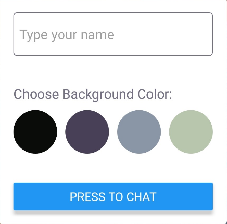

# ChatApp

A chat app for mobile devices using React Native. The app will provide users with a chat interface and options to share images and their location.

## Key Features

- A page where users can enter their name and choose a background color for the chat screen before joining the chat.
- A page displaying the conversation, as well as an input field and submit button.
- The chat must provide users with two additional communication features: sending images and location data.
- Data gets stored online and offline

## Built with

- expo
- expo-image-picker
- expo-location
- expo-permissions
- firebase
- react
- react-dom
- react-native
- react-native-gifted-chat
- react-native-keyboard-spacer
- react-native-maps
- react-native-web
- react-navigation
- react-navigation-stack

## Setting up the app
To develop and test native apps with React Native, Facebook recommends using Expo.

Expo is an open-source platform for making universal native apps that run on Android, iOS, and the web. There are two tools that you need to develop apps with Expo: a command line app called Expo CLI to initialize and serve your project and a mobile client app called Expo Go to open it on iOS and Android. To install Expo CLI on your computer, you need to have previously installed Node.js (LTS release).

`npm install --global expo-cli`

## Dependencies installation

Install all dependencies listed in package.json in the local node_modules folder with the following npm command:

`npm install`

## Configuration
- Once you have the project on your computer, and you have installed Expo CLI and all the dependencies, you can start using (and modifying) the project.

- In order to use the cloud storage, you need to have a Firebase account and create a new project for the app. Once inside the new project created, you must enable authentication with at least the anonymous option activated, so that users can use the app. To do this, you must go to the "Authentication" option in the Firebase main menu.

- To save the messages sent by users, you must create a collection in Cloud Firestore. To do this, you must go to the "Firestore Database" option in the Firebase main menu.

- Finally, you must go to the project configuration, and in the "General" tab you will find the SDK Configuration. You must copy the configuration code of your Firebase service into the "Chat" component of the app. 

## Start the App

Navigate to the root folder  in your terminal and type:

`expo start` or `npm start`

## Run on Mobile Device
After starting the app, use your mobile to scan the QR code with the Expo app (Android) or the device's camera (iOS).

## Run on Simulator/Emulator
After starting the app, type 'a' in your CLI to run the app on an Android emulator, and 'i' to run it on an iOS simulator.
